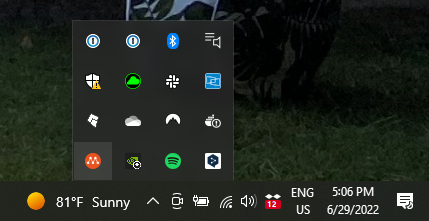

# 用自己的台式机作为服务器

最近弄了一些云服务器上的数据操作, 随后发现费用惊人, 倒腾了几个T的数据, 就要几千块钱了。实在是承受不了, 遂打算自己在家弄个服务器。

开始的时候看了一下网上二手服务器机架的价格, 发现一千多也能买到基本能用的机架式服务器了, 一般的配置都是十核以内, 32G内存以内, 个数级别T的硬盘, 感觉还是挺香的, 但是感觉这种服务器运维成本略高, 可以考虑有更多这方面的需求再进行配置。

所以我我目前的打算就是花更少的钱, 只要保证家里的电脑24小时开机, 就相当于一台服务器在被我们使用。

目前的需求很简单:

1. 能够远程连接到自己的电脑, 运行linux系统进行linux机器的开发测试
2. IP期望长期不变


把目标大概分成一下几部:

1. 能够ssh链接win主机
2. win搭建linux虚拟机
3. 挂载磁盘, ssh远程跳板链接
4. 动态IP问题


### ssh链接win主机

主要的就是在win上安装openssl的server, 具体看[这里](https://learn.microsoft.com/zh-cn/windows-server/administration/openssh/openssh_install_firstuse)

如何查看机器的公网IP, 只需要在powershell输入`ipconfig` , 然后取其中的IPV4地址就可以。一般来说执行完上述的步骤就已经可以ssh登录成功了, 但是我自己在进行尝试的时候遇到了一些问题, 如果有朋友遇到相应的问题可以参考。

按照以上教程完成后发现有问题：

```shell
# 从win本地
ssh admin@127.0.0.1 #成功
ssh admin@公网ip     #成功
# 从其他机器
ssh admin@公网ip     #失败
```

在win上执行

```shell
sshd -d
no hostkeys available -- exiting.
```

通过如下方法解决:

```shell
# 以管理员省份运行powershell
ssh-keygen -A
```

随后又遇到问题, 但这不是很主要的问题, 整个程序能够正常启动并且监听

```powershell
# 管理员身份运行powershell
sshd -dd
get_passwd lookupaccountname() failed 1332
```

最后问了同学发现因为我链接的是一台PC, 是通过wifi连校园网到网络的, 可能学校的校园网对ssh行为做了一些限制导致无法ssh到对应的端口, 如果两台电脑都连接手机的热点时, 就可以work了, 所以在测试时有个好的网路环境还是比较重要的。


## win搭建linux环境

本来想介绍一下vmware的, 结果搜着搜着发现了一个非常好用的工具, 直接抛弃了VMware, 连安装都没有安装(乐)。

#### 方法二：multipass

multipass是一个开源的，将ubuntu虚拟机挂载在任意平台操作系统上的软件, 并且multipass在linux上使用了KVM用于加速, 在windows上使用了Hyper-V用于加速, 在macOS上使用了HyperKit用于加速。所以在各个平台上的性能优化都是比较好的。

而且[文档社区](https://discourse.ubuntu.com/c/multipass/21/none)的支持也比较好, 更关键的是, 它是一个命令行工具, 这非常适合我们这样以远程连接为目的用户。

在win上安装前先在mac上试了一下, 全称连下载也是由软件完成了, 更加厉害的是下载的直接是ARM版本的ubuntu, 确实有点牛的。

从github下载multipass[安装包](https://github.com/canonical/multipass/releases/download/v1.11.1/multipass-1.11.1+win-win64.exe), 如果翻墙困难可以催我上传百度云盘(TODO)。

##### 安装:

- 打开安装包
- 点击`下一步`
- 点击`我接受`
- 选择Hypervisor
  - 一般来说新的CPU和新的Windows都是支持Hyper-V的, 如果你电脑比较新, 则强烈建议选Hyper-V, 这可以提高性能
  - 如果电脑或者CPU版本过老, 则选择VirtualBox
  - 选择完后点`下一步`
- 选择Add PATH, 这样就能直接使用命令行工具, 点`下一步`
- 选择安装位置, 这个随意, 选完后点`下一步`
- 点`安装`

选择结束后立即重启。


##### 小白使用

打开multipass后右下角的程序栏中会出现multipass的标签: 

’

单击后点击这个图片后点击`open shell`, 然后会打开一个命令行, 记得要鼠标多点几下这个命令行(不点貌似界面会卡住), 这一步会做非常多的事情, 这也是为什么会称之为小白使用。具体会做以下几个事:

- 创建一个新的虚拟机实例 `primary`, 虚拟机参数为 1GB 内存, 5GB硬盘,  1个CPU; 
- 安装的虚拟机是 Ubuntu LTS 的最新发行版; 
- 会把\$HOME 文件夹挂载在实例中(MacOS如此, win可能会找不到\$HOME这个环境变量而失效); 
- 打开这个虚拟机的命令行,  命令行前缀为 `ubuntu@primary`, 欢迎信息如下:

```txt
Welcome to Ubuntu 22.04.2 LTS (GNU/Linux 5.15.0-67-generic aarch64)

 * Documentation:  https://help.ubuntu.com
 * Management:     https://landscape.canonical.com
 * Support:        https://ubuntu.com/advantage

  System information as of Sat Apr 15 18:22:18 CST 2023

  System load:             0.02734375
  Usage of /:              30.1% of 4.68GB
  Memory usage:            19%
  Swap usage:              0%
  Processes:               90
  Users logged in:         0
  IPv4 address for enp0s1: xxxx
  IPv6 address for enp0s1: xxxx


 * Introducing Expanded Security Maintenance for Applications.
   Receive updates to over 25,000 software packages with your
   Ubuntu Pro subscription. Free for personal use.

     https://ubuntu.com/pro

Expanded Security Maintenance for Applications is not enabled.

0 updates can be applied immediately.

Enable ESM Apps to receive additional future security updates.
See https://ubuntu.com/esm or run: sudo pro status


The list of available updates is more than a week old.
To check for new updates run: sudo apt update
```

如果作为联系linux的工具, 则可以每次都打开这个primary机器就可以了。


##### 其他基本操作

```shell
# 查看当前电脑中已存在的虚拟机。
multipass list
# 查看一个虚拟机的具体信息
multipass info <虚拟机名称>
# 关闭虚拟机
multipass stop <虚拟机名称>
# 打开虚拟机(基于名称)
multipass shell <虚拟机名称>
# 临时需要在虚拟机执行命令, 但是不进入shell
multipass exec <虚拟机名称> -- <命令>  # 命令可以是 uname -a 或者 lsb_release -a
```


##### 设置硬件资源

其实感觉没有必要弄那么多虚拟机在一台电脑上，用default的primary就很不错了，如果需要再进行环境的安装，一方面可以再primary中起docker，一方面也可以再开新的虚拟机。

新建虚拟机实例并设置硬件资源

```shell
multipass help launch

multipass launch   -v     # 显示launch时的详细信息 \
  -c, --cpus <cpus>       # 最小为1, 默认为1 \
  -d, --disk <disk>       # 最小为512M, 默认为5G \
  -m, --memory <memory>   # 最小为128M, 默认为1G \
  -n, --name <name>       # 虚拟机实例的名字 \
  --network <spec>        # 网络设置,可以不用设置按照默认来 \
  --mount <local-path>:<instance-path> # 文件挂载
```

可以给个具体的例子:

```shell
multipass launch -v -c 1 -d 5G -m 2G -n test --mount D:\\:/mount
```

以上的命令创建了一个名为test的虚拟机实例, 使用1个CPU, 内存资源是2G, 磁盘是5G, 本地D盘被挂载在虚拟机的`/mount`下。注意, 在win上对文件的mount默认是不启用的, 如果需要这么做需要手动开启`multipass set local.privileged-mounts=Yes`。

此外, 在创建完虚拟机后也可以手动进行文件夹的挂载。

```shell
multipass mount <本机源文件路径>   <实例名称>:<实例中的路径>
```


##### 修改硬件资源

下面说明在已经创建好实例的情况下进行资源的修改。


##### 其他

删除实例

```shell
multipass delete ubuntu-lts
multipass delete --purge ubuntu-lts
```

