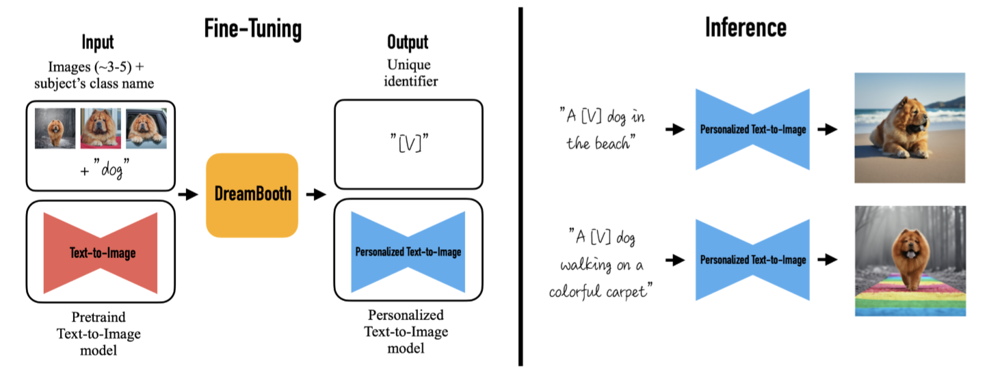
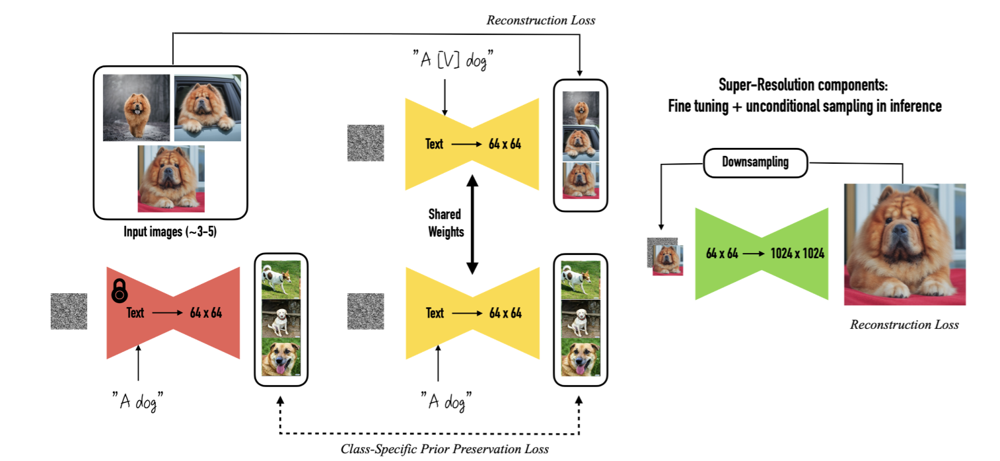
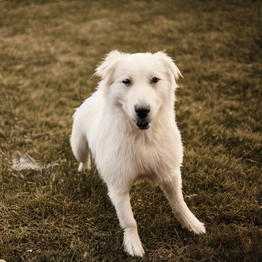
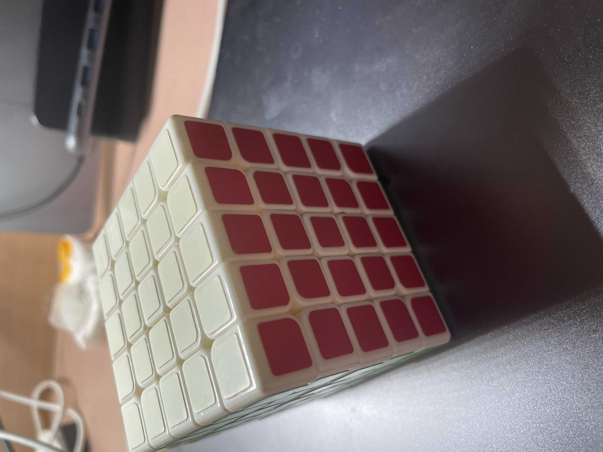
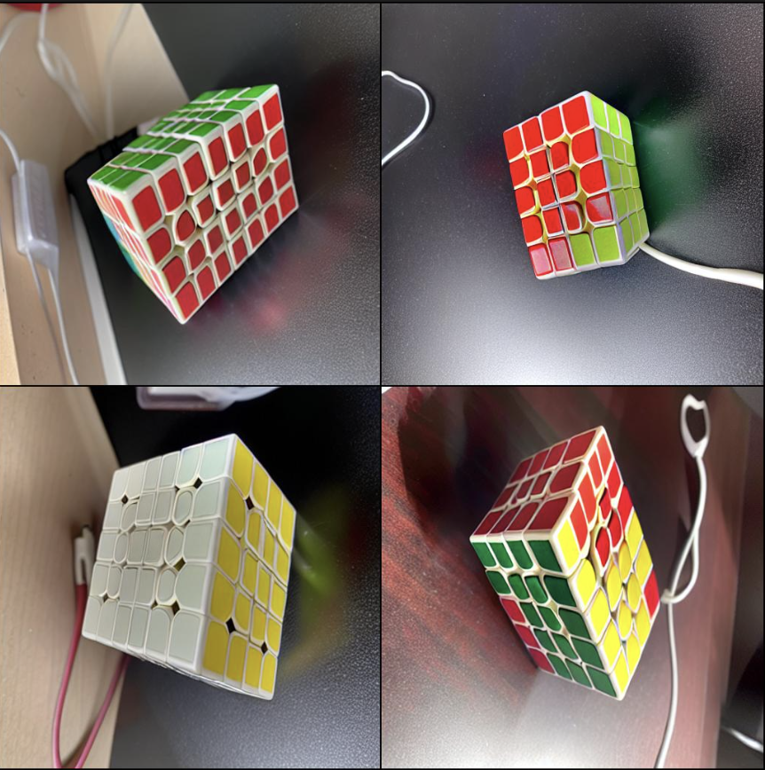

# DreamBooth

- [toc]

## 前言

这一部分主要聚焦如何控制一个固定物体在生成过程中出现, 并且细节也很到位, 这里的复现工作基于google的文章“DreamBooth: Fine Tuning Text-to-Image Diffusion Models for Subject-Driven Generation” , 代码则基于https://github.com/XavierXiao/Dreambooth-Stable-Diffusion, 这是基于stable-diffusion的实现。








我们在这里期望做到以下几点:

1. 复现代码和文章, 看看效果
2. 对比finetune前后的模型, 哪些参数改变比较大? 
3. 正则化对其他类型的生成有多大影响?
4. 尝试fix住一部分参数的效果
5. 思考如何使用参数高效微调。


## 复现和熟悉过程

话不多说, 直接上命令。

```shell
git clone git@github.com:Xiang-cd/Dreambooth-Stable-Diffusion.git
conda env create -f environment.yaml
conda activate ldm
```

接下来需要下载模型, 这里需要如下命令, 并且需要huggingface的账户, 运行后输入密码即可, 随后会开始下载, 请记住你下载的路径:

```shell
wget https://huggingface.co/CompVis/stable-diffusion-v-1-4-original/resolve/main/sd-v1-4-full-ema.ckpt --user=Xiang-cd --ask-password
https://huggingface.co/CompVis/stable-diffusion-v-1-4-original/resolve/main/sd-v1-4.ckpt
```


根据文章, 为了正则化模型, 首先会让模型生成很多的同类图片, 需要指定种类, 例如你希望你家的狗(一只特定的狗), 准确的被生成, 但同时又希望同时保持生成其他种类的狗的能力, 所以你需要准备很多其他狗的照片, 在finetune的过程中同时设置相应loss, 保持模型生成其他狗的能力, 所以, 我们调动生成器, 进行生成。

第一步我们使用狗作为正则化的图片。

```shell
python scripts/stable_txt2img.py \
--ddim_eta 0.0 --n_samples 2 --n_iter 100 \
--scale 10.0 --ddim_steps 50  \
--ckpt /mfs/xiangchendong19/stable-diffusion-ckpt/sd-v1-4-full-ema.ckpt \
--prompt "a photo of a dog" \
--outdir  /home/xiangchendong19/Dreambooth-Stable-Diffusion/data/xiaoyang/reg_dog 
```

魔方其实在stable diffusion的生成中其实没有很好的效果, 我们想看看, 如果利用finetune的方法,  能不能至少生成一个像样的魔方。

```shell
python scripts/stable_txt2img.py \
--ddim_eta 0.0 --n_samples 2 --n_iter 100 \
--scale 10.0 --ddim_steps 50  \
--ckpt /mfs/xiangchendong19/stable-diffusion-ckpt/sd-v1-4-full-ema.ckpt \
--prompt "a photo of a magic cube" \
--outdir  /home/xiangchendong19/Dreambooth-Stable-Diffusion/data/cube/reg_cube
```


第二步, 同时我们可以进行finetune, 因为文件系统磁盘的原因, 把输出的模型参数的位置改了一下, 具体的脚本含义看源代码仓库的readme就可以:

```shell
python main.py \
--base configs/stable-diffusion/v1-finetune_unfrozen.yaml \
-t \
--actual_resume ~/stable-diffusion-ckpt/sd-v1-4-full-ema.ckpt  \
-n xiaoyang \
--gpus 0, \
--data_root ~/Dreambooth-Stable-Diffusion/data/xiaoyang/example \
--reg_data_root ~/Dreambooth-Stable-Diffusion/data/xiaoyang/reg_dog/samples \
--class_word dog \
--logdir ~/DreamBoothlog
```


```shell
python main.py \
--base configs/stable-diffusion/v1-finetune_unfrozen.yaml \
-t \
--actual_resume ~/stable-diffusion-ckpt/sd-v1-4-full-ema.ckpt  \
-n cube \
--gpus 0, \
--data_root ~/Dreambooth-Stable-Diffusion/data/cube/example \
--reg_data_root ~/Dreambooth-Stable-Diffusion/data/cube/reg_cube/samples \
--class_word "magic cube" 
```


第三步, 生成

```shell
python scripts/stable_txt2img.py \
--ddim_eta 0.0 \
--n_samples 4 \
--n_iter 1 \
--scale 10.0 \
--ddim_steps 100  \
--ckpt ~/Dreambooth-Stable-Diffusion/logs/example2022-10-31T16-56-41_xiaoyang/checkpoints/last.ckpt \
--prompt "photo of a sks dog"
```


```shell
python scripts/stable_txt2img.py \
--ddim_eta 0.0 \
--n_samples 4 \
--n_iter 1 \
--scale 10.0 \
--ddim_steps 100  \
--ckpt /mfs/xiangchendong19/stable-diffusion-ckpt/cube.ckpt \ 
--prompt "photo of a sks magic cube"
```


### 粗读代码

同理, 我们来看看代码的实现是怎么样来进行训练的吧!

```python
# load 一些包
import argparse, os, sys, datetime, glob, importlib, csv
import numpy as np
import time
import torch

import torchvision
import pytorch_lightning as pl

from packaging import version
from omegaconf import OmegaConf
from torch.utils.data import random_split, DataLoader, Dataset, Subset
from functools import partial
from PIL import Image

from pytorch_lightning import seed_everything
from pytorch_lightning.trainer import Trainer
from pytorch_lightning.callbacks import ModelCheckpoint, Callback, LearningRateMonitor
from pytorch_lightning.utilities.distributed import rank_zero_only
from pytorch_lightning.utilities import rank_zero_info

from ldm.data.base import Txt2ImgIterableBaseDataset
from ldm.util import instantiate_from_config

# 依据config文件, 从ckpt路径中加载模型
def load_model_from_config(config, ckpt, verbose=False):
    print(f"Loading model from {ckpt}")
    pl_sd = torch.load(ckpt, map_location="cpu")
    sd = pl_sd["state_dict"]
    config.model.params.ckpt_path = ckpt
    model = instantiate_from_config(config.model)
    m, u = model.load_state_dict(sd, strict=False)
    if len(m) > 0 and verbose:
        print("missing keys:")
        print(m)
    if len(u) > 0 and verbose:
        print("unexpected keys:")
        print(u)

    model.cuda()
    return model

def get_parser(**parser_kwargs):
    def str2bool(v):
        if isinstance(v, bool):
            return v
        if v.lower() in ("yes", "true", "t", "y", "1"):
            return True
        elif v.lower() in ("no", "false", "f", "n", "0"):
            return False
        else:
            raise argparse.ArgumentTypeError("Boolean value expected.")

    parser = argparse.ArgumentParser(**parser_kwargs)
    parser.add_argument(
        "-n",
        "--name",
        type=str,
        const=True,
        default="",
        nargs="?",
        help="postfix for logdir",
    )
    parser.add_argument(
        "-r",
        "--resume",
        type=str,
        const=True,
        default="",
        nargs="?",
        help="resume from logdir or checkpoint in logdir",
    )
    parser.add_argument(
        "-b",
        "--base",
        nargs="*",
        metavar="base_config.yaml",
        help="paths to base configs. Loaded from left-to-right. "
             "Parameters can be overwritten or added with command-line options of the form `--key value`.",
        default=list(),
    )
    parser.add_argument(
        "-t",
        "--train",
        type=str2bool,
        const=True,
        default=False,
        nargs="?",
        help="train",
    )
    parser.add_argument(
        "--no-test",
        type=str2bool,
        const=True,
        default=False,
        nargs="?",
        help="disable test",
    )
    parser.add_argument(
        "-p",
        "--project",
        help="name of new or path to existing project"
    )
    parser.add_argument(
        "-d",
        "--debug",
        type=str2bool,
        nargs="?",
        const=True,
        default=False,
        help="enable post-mortem debugging",
    )
    parser.add_argument(
        "-s",
        "--seed",
        type=int,
        default=23,
        help="seed for seed_everything",
    )
    parser.add_argument(
        "-f",
        "--postfix",
        type=str,
        default="",
        help="post-postfix for default name",
    )
    parser.add_argument(
        "-l",
        "--logdir",
        type=str,
        default="logs",
        help="directory for logging dat shit",
    )
    parser.add_argument(
        "--scale_lr",
        type=str2bool,
        nargs="?",
        const=False,
        default=False,
        help="scale base-lr by ngpu * batch_size * n_accumulate",
    )

    parser.add_argument(
        "--datadir_in_name", 
        type=str2bool, 
        nargs="?", 
        const=True, 
        default=True, 
        help="Prepend the final directory in the data_root to the output directory name")

    parser.add_argument("--actual_resume", 
        type=str,
        required=True,
        help="Path to model to actually resume from")

    parser.add_argument("--data_root", 
        type=str, 
        required=True, 
        help="Path to directory with training images")
    
    parser.add_argument("--reg_data_root", 
        type=str, 
        required=True, 
        help="Path to directory with regularization images")

    parser.add_argument("--embedding_manager_ckpt", 
        type=str, 
        default="", 
        help="Initialize embedding manager from a checkpoint")

    parser.add_argument("--class_word", 
        type=str, 
        default="dog",
        help="Placeholder token which will be used to denote the concept in future prompts")

    parser.add_argument("--init_word", 
        type=str, 
        help="Word to use as source for initial token embedding")

    return parser


def nondefault_trainer_args(opt):
    parser = argparse.ArgumentParser()
    parser = Trainer.add_argparse_args(parser)
    args = parser.parse_args([])
    return sorted(k for k in vars(args) if getattr(opt, k) != getattr(args, k))


class WrappedDataset(Dataset):
    """Wraps an arbitrary object with __len__ and __getitem__ into a pytorch dataset"""

    def __init__(self, dataset):
        self.data = dataset

    def __len__(self):
        return len(self.data)

    def __getitem__(self, idx):
        return self.data[idx]


def worker_init_fn(_):
    worker_info = torch.utils.data.get_worker_info()

    dataset = worker_info.dataset
    worker_id = worker_info.id

    if isinstance(dataset, Txt2ImgIterableBaseDataset):
        split_size = dataset.num_records // worker_info.num_workers
        # reset num_records to the true number to retain reliable length information
        dataset.sample_ids = dataset.valid_ids[worker_id * split_size:(worker_id + 1) * split_size]
        current_id = np.random.choice(len(np.random.get_state()[1]), 1)
        return np.random.seed(np.random.get_state()[1][current_id] + worker_id)
    else:
        return np.random.seed(np.random.get_state()[1][0] + worker_id)

class ConcatDataset(Dataset):
    def __init__(self, *datasets):
        self.datasets = datasets

    def __getitem__(self, idx):
        return tuple(d[idx] for d in self.datasets)

    def __len__(self):
        return min(len(d) for d in self.datasets)
    
class DataModuleFromConfig(pl.LightningDataModule):
    def __init__(self, batch_size, train=None, reg = None, validation=None, test=None, predict=None,
                 wrap=False, num_workers=None, shuffle_test_loader=False, use_worker_init_fn=False,
                 shuffle_val_dataloader=False):
        super().__init__()
        self.batch_size = batch_size
        self.dataset_configs = dict()
        self.num_workers = num_workers if num_workers is not None else batch_size * 2
        self.use_worker_init_fn = use_worker_init_fn
        if train is not None:
            self.dataset_configs["train"] = train
        if reg is not None:
            self.dataset_configs["reg"] = reg
        
        self.train_dataloader = self._train_dataloader
        
        if validation is not None:
            self.dataset_configs["validation"] = validation
            self.val_dataloader = partial(self._val_dataloader, shuffle=shuffle_val_dataloader)
        if test is not None:
            self.dataset_configs["test"] = test
            self.test_dataloader = partial(self._test_dataloader, shuffle=shuffle_test_loader)
        if predict is not None:
            self.dataset_configs["predict"] = predict
            self.predict_dataloader = self._predict_dataloader
        self.wrap = wrap

    def prepare_data(self):
        for data_cfg in self.dataset_configs.values():
            instantiate_from_config(data_cfg)

    def setup(self, stage=None):
        self.datasets = dict(
            (k, instantiate_from_config(self.dataset_configs[k]))
            for k in self.dataset_configs)
        if self.wrap:
            for k in self.datasets:
                self.datasets[k] = WrappedDataset(self.datasets[k])

    def _train_dataloader(self):
        is_iterable_dataset = isinstance(self.datasets['train'], Txt2ImgIterableBaseDataset)
        if is_iterable_dataset or self.use_worker_init_fn:
            init_fn = worker_init_fn
        else:
            init_fn = None
        train_set = self.datasets["train"]
        reg_set = self.datasets["reg"]
        concat_dataset = ConcatDataset(train_set, reg_set)
        return DataLoader(concat_dataset, batch_size=self.batch_size,
                          num_workers=self.num_workers, shuffle=False if is_iterable_dataset else True,
                          worker_init_fn=init_fn)

    def _val_dataloader(self, shuffle=False):
        if isinstance(self.datasets['validation'], Txt2ImgIterableBaseDataset) or self.use_worker_init_fn:
            init_fn = worker_init_fn
        else:
            init_fn = None
        return DataLoader(self.datasets["validation"],
                          batch_size=self.batch_size,
                          num_workers=self.num_workers,
                          worker_init_fn=init_fn,
                          shuffle=shuffle)

    def _test_dataloader(self, shuffle=False):
        is_iterable_dataset = isinstance(self.datasets['train'], Txt2ImgIterableBaseDataset)
        if is_iterable_dataset or self.use_worker_init_fn:
            init_fn = worker_init_fn
        else:
            init_fn = None

        # do not shuffle dataloader for iterable dataset
        shuffle = shuffle and (not is_iterable_dataset)

        return DataLoader(self.datasets["test"], batch_size=self.batch_size,
                          num_workers=self.num_workers, worker_init_fn=init_fn, shuffle=shuffle)

    def _predict_dataloader(self, shuffle=False):
        if isinstance(self.datasets['predict'], Txt2ImgIterableBaseDataset) or self.use_worker_init_fn:
            init_fn = worker_init_fn
        else:
            init_fn = None
        return DataLoader(self.datasets["predict"], batch_size=self.batch_size,
                          num_workers=self.num_workers, worker_init_fn=init_fn)


class SetupCallback(Callback):
    def __init__(self, resume, now, logdir, ckptdir, cfgdir, config, lightning_config):
        super().__init__()
        self.resume = resume
        self.now = now
        self.logdir = logdir
        self.ckptdir = ckptdir
        self.cfgdir = cfgdir
        self.config = config
        self.lightning_config = lightning_config

    def on_keyboard_interrupt(self, trainer, pl_module):
        if trainer.global_rank == 0:
            print("Summoning checkpoint.")
            ckpt_path = os.path.join(self.ckptdir, "last.ckpt")
            trainer.save_checkpoint(ckpt_path)

    def on_pretrain_routine_start(self, trainer, pl_module):
        if trainer.global_rank == 0:
            # Create logdirs and save configs
            os.makedirs(self.logdir, exist_ok=True)
            os.makedirs(self.ckptdir, exist_ok=True)
            os.makedirs(self.cfgdir, exist_ok=True)

            if "callbacks" in self.lightning_config:
                if 'metrics_over_trainsteps_checkpoint' in self.lightning_config['callbacks']:
                    os.makedirs(os.path.join(self.ckptdir, 'trainstep_checkpoints'), exist_ok=True)
            print("Project config")
            print(OmegaConf.to_yaml(self.config))
            OmegaConf.save(self.config,
                           os.path.join(self.cfgdir, "{}-project.yaml".format(self.now)))

            print("Lightning config")
            print(OmegaConf.to_yaml(self.lightning_config))
            OmegaConf.save(OmegaConf.create({"lightning": self.lightning_config}),
                           os.path.join(self.cfgdir, "{}-lightning.yaml".format(self.now)))

        else:
            # ModelCheckpoint callback created log directory --- remove it
            if not self.resume and os.path.exists(self.logdir):
                dst, name = os.path.split(self.logdir)
                dst = os.path.join(dst, "child_runs", name)
                os.makedirs(os.path.split(dst)[0], exist_ok=True)
                try:
                    os.rename(self.logdir, dst)
                except FileNotFoundError:
                    pass


class ImageLogger(Callback):
    def __init__(self, batch_frequency, max_images, clamp=True, increase_log_steps=True,
                 rescale=True, disabled=False, log_on_batch_idx=False, log_first_step=False,
                 log_images_kwargs=None):
        super().__init__()
        self.rescale = rescale
        self.batch_freq = batch_frequency
        self.max_images = max_images
        self.logger_log_images = {
            pl.loggers.TestTubeLogger: self._testtube,
        }
        self.log_steps = [2 ** n for n in range(int(np.log2(self.batch_freq)) + 1)]
        if not increase_log_steps:
            self.log_steps = [self.batch_freq]
        self.clamp = clamp
        self.disabled = disabled
        self.log_on_batch_idx = log_on_batch_idx
        self.log_images_kwargs = log_images_kwargs if log_images_kwargs else {}
        self.log_first_step = log_first_step

    @rank_zero_only
    def _testtube(self, pl_module, images, batch_idx, split):
        for k in images:
            grid = torchvision.utils.make_grid(images[k])
            grid = (grid + 1.0) / 2.0  # -1,1 -> 0,1; c,h,w

            tag = f"{split}/{k}"
            pl_module.logger.experiment.add_image(
                tag, grid,
                global_step=pl_module.global_step)

    @rank_zero_only
    def log_local(self, save_dir, split, images,
                  global_step, current_epoch, batch_idx):
        root = os.path.join(save_dir, "images", split)
        for k in images:
            grid = torchvision.utils.make_grid(images[k], nrow=4)
            if self.rescale:
                grid = (grid + 1.0) / 2.0  # -1,1 -> 0,1; c,h,w
            grid = grid.transpose(0, 1).transpose(1, 2).squeeze(-1)
            grid = grid.numpy()
            grid = (grid * 255).astype(np.uint8)
            filename = "{}_gs-{:06}_e-{:06}_b-{:06}.jpg".format(
                k,
                global_step,
                current_epoch,
                batch_idx)
            path = os.path.join(root, filename)
            os.makedirs(os.path.split(path)[0], exist_ok=True)
            Image.fromarray(grid).save(path)

    def log_img(self, pl_module, batch, batch_idx, split="train"):
        check_idx = batch_idx if self.log_on_batch_idx else pl_module.global_step
        if (self.check_frequency(check_idx) and  # batch_idx % self.batch_freq == 0
                hasattr(pl_module, "log_images") and
                callable(pl_module.log_images) and
                self.max_images > 0):
            logger = type(pl_module.logger)

            is_train = pl_module.training
            if is_train:
                pl_module.eval()

            with torch.no_grad():
                images = pl_module.log_images(batch, split=split, **self.log_images_kwargs)

            for k in images:
                N = min(images[k].shape[0], self.max_images)
                images[k] = images[k][:N]
                if isinstance(images[k], torch.Tensor):
                    images[k] = images[k].detach().cpu()
                    if self.clamp:
                        images[k] = torch.clamp(images[k], -1., 1.)

            self.log_local(pl_module.logger.save_dir, split, images,
                           pl_module.global_step, pl_module.current_epoch, batch_idx)

            logger_log_images = self.logger_log_images.get(logger, lambda *args, **kwargs: None)
            logger_log_images(pl_module, images, pl_module.global_step, split)

            if is_train:
                pl_module.train()

    def check_frequency(self, check_idx):
        if ((check_idx % self.batch_freq) == 0 or (check_idx in self.log_steps)) and (
                check_idx > 0 or self.log_first_step):
            try:
                self.log_steps.pop(0)
            except IndexError as e:
                print(e)
                pass
            return True
        return False

    def on_train_batch_end(self, trainer, pl_module, outputs, batch, batch_idx, dataloader_idx):
        if not self.disabled and (pl_module.global_step > 0 or self.log_first_step):
            self.log_img(pl_module, batch, batch_idx, split="train")

    def on_validation_batch_end(self, trainer, pl_module, outputs, batch, batch_idx, dataloader_idx):
        if not self.disabled and pl_module.global_step > 0:
            self.log_img(pl_module, batch, batch_idx, split="val")
        if hasattr(pl_module, 'calibrate_grad_norm'):
            if (pl_module.calibrate_grad_norm and batch_idx % 25 == 0) and batch_idx > 0:
                self.log_gradients(trainer, pl_module, batch_idx=batch_idx)


class CUDACallback(Callback):
    # see https://github.com/SeanNaren/minGPT/blob/master/mingpt/callback.py
    def on_train_epoch_start(self, trainer, pl_module):
        # Reset the memory use counter
        torch.cuda.reset_peak_memory_stats(trainer.root_gpu)
        torch.cuda.synchronize(trainer.root_gpu)
        self.start_time = time.time()

    def on_train_epoch_end(self, trainer, pl_module):
        torch.cuda.synchronize(trainer.root_gpu)
        max_memory = torch.cuda.max_memory_allocated(trainer.root_gpu) / 2 ** 20
        epoch_time = time.time() - self.start_time

        try:
            max_memory = trainer.training_type_plugin.reduce(max_memory)
            epoch_time = trainer.training_type_plugin.reduce(epoch_time)

            rank_zero_info(f"Average Epoch time: {epoch_time:.2f} seconds")
            rank_zero_info(f"Average Peak memory {max_memory:.2f}MiB")
        except AttributeError:
            pass

class ModeSwapCallback(Callback):

    def __init__(self, swap_step=2000):
        super().__init__()
        self.is_frozen = False
        self.swap_step = swap_step

    def on_train_epoch_start(self, trainer, pl_module):
        if trainer.global_step < self.swap_step and not self.is_frozen:
            self.is_frozen = True
            trainer.optimizers = [pl_module.configure_opt_embedding()]

        if trainer.global_step > self.swap_step and self.is_frozen:
            self.is_frozen = False
            trainer.optimizers = [pl_module.configure_opt_model()]

if __name__ == "__main__":
    # custom parser to specify config files, train, test and debug mode,
    # postfix, resume.
    # `--key value` arguments are interpreted as arguments to the trainer.
    # `nested.key=value` arguments are interpreted as config parameters.
    # configs are merged from left-to-right followed by command line parameters.

    # model:
    #   base_learning_rate: float
    #   target: path to lightning module
    #   params:
    #       key: value
    # data:
    #   target: main.DataModuleFromConfig
    #   params:
    #      batch_size: int
    #      wrap: bool
    #      train:
    #          target: path to train dataset
    #          params:
    #              key: value
    #      validation:
    #          target: path to validation dataset
    #          params:
    #              key: value
    #      test:
    #          target: path to test dataset
    #          params:
    #              key: value
    # lightning: (optional, has sane defaults and can be specified on cmdline)
    #   trainer:
    #       additional arguments to trainer
    #   logger:
    #       logger to instantiate
    #   modelcheckpoint:
    #       modelcheckpoint to instantiate
    #   callbacks:
    #       callback1:
    #           target: importpath
    #           params:
    #               key: value

    now = datetime.datetime.now().strftime("%Y-%m-%dT%H-%M-%S")

    # add cwd for convenience and to make classes in this file available when
    # running as `python main.py`
    # (in particular `main.DataModuleFromConfig`)
    sys.path.append(os.getcwd())

    parser = get_parser()
    parser = Trainer.add_argparse_args(parser)

    opt, unknown = parser.parse_known_args()
    if opt.name and opt.resume:
        raise ValueError(
            "-n/--name and -r/--resume cannot be specified both."
            "If you want to resume training in a new log folder, "
            "use -n/--name in combination with --resume_from_checkpoint"
        )
    if opt.resume:
        if not os.path.exists(opt.resume):
            raise ValueError("Cannot find {}".format(opt.resume))
        if os.path.isfile(opt.resume):
            paths = opt.resume.split("/")
            # idx = len(paths)-paths[::-1].index("logs")+1
            # logdir = "/".join(paths[:idx])
            logdir = "/".join(paths[:-2])
            ckpt = opt.resume
        else:
            assert os.path.isdir(opt.resume), opt.resume
            logdir = opt.resume.rstrip("/")
            ckpt = os.path.join(logdir, "checkpoints", "last.ckpt")

        opt.resume_from_checkpoint = ckpt
        base_configs = sorted(glob.glob(os.path.join(logdir, "configs/*.yaml")))
        opt.base = base_configs + opt.base
        _tmp = logdir.split("/")
        nowname = _tmp[-1]
    else:
        if opt.name:
            name = "_" + opt.name
        elif opt.base:
            cfg_fname = os.path.split(opt.base[0])[-1]
            cfg_name = os.path.splitext(cfg_fname)[0]
            name = "_" + cfg_name
        else:
            name = ""

        if opt.datadir_in_name:
            now = os.path.basename(os.path.normpath(opt.data_root)) + now
            
        nowname = now + name + opt.postfix
        logdir = os.path.join(opt.logdir, nowname)

    ckptdir = os.path.join(logdir, "checkpoints")
    cfgdir = os.path.join(logdir, "configs")
    seed_everything(opt.seed)

    try:
        # init and save configs
        configs = [OmegaConf.load(cfg) for cfg in opt.base]
        cli = OmegaConf.from_dotlist(unknown)
        config = OmegaConf.merge(*configs, cli)
        lightning_config = config.pop("lightning", OmegaConf.create())
        # merge trainer cli with config
        trainer_config = lightning_config.get("trainer", OmegaConf.create())
        # default to ddp
        trainer_config["accelerator"] = "ddp"
        for k in nondefault_trainer_args(opt):
            trainer_config[k] = getattr(opt, k)
        if not "gpus" in trainer_config:
            del trainer_config["accelerator"]
            cpu = True
        else:
            gpuinfo = trainer_config["gpus"]
            print(f"Running on GPUs {gpuinfo}")
            cpu = False
        trainer_opt = argparse.Namespace(**trainer_config)
        lightning_config.trainer = trainer_config

        # model

        # config.model.params.personalization_config.params.init_word = opt.init_word
        # config.model.params.personalization_config.params.embedding_manager_ckpt = opt.embedding_manager_ckpt
        # config.model.params.personalization_config.params.placeholder_tokens = opt.placeholder_tokens

        # if opt.init_word:
        #     config.model.params.personalization_config.params.initializer_words[0] = opt.init_word
            
        config.data.params.train.params.placeholder_token = opt.class_word
        config.data.params.reg.params.placeholder_token = opt.class_word
        config.data.params.validation.params.placeholder_token = opt.class_word

        if opt.actual_resume:
            model = load_model_from_config(config, opt.actual_resume)
        else:
            model = instantiate_from_config(config.model)

        # trainer and callbacks
        trainer_kwargs = dict()

        # default logger configs
        default_logger_cfgs = {
            "wandb": {
                "target": "pytorch_lightning.loggers.WandbLogger",
                "params": {
                    "name": nowname,
                    "save_dir": logdir,
                    "offline": opt.debug,
                    "id": nowname,
                }
            },
            "testtube": {
                "target": "pytorch_lightning.loggers.TestTubeLogger",
                "params": {
                    "name": "testtube",
                    "save_dir": logdir,
                }
            },
        }
        default_logger_cfg = default_logger_cfgs["testtube"]
        if "logger" in lightning_config:
            logger_cfg = lightning_config.logger
        else:
            logger_cfg = OmegaConf.create()
        logger_cfg = OmegaConf.merge(default_logger_cfg, logger_cfg)
        trainer_kwargs["logger"] = instantiate_from_config(logger_cfg)

        # modelcheckpoint - use TrainResult/EvalResult(checkpoint_on=metric) to
        # specify which metric is used to determine best models
        default_modelckpt_cfg = {
            "target": "pytorch_lightning.callbacks.ModelCheckpoint",
            "params": {
                "dirpath": ckptdir,
                "filename": "{epoch:06}",
                "verbose": True,
                "save_last": True,
            }
        }
        if hasattr(model, "monitor"):
            print(f"Monitoring {model.monitor} as checkpoint metric.")
            default_modelckpt_cfg["params"]["monitor"] = model.monitor
            default_modelckpt_cfg["params"]["save_top_k"] = 1

        if "modelcheckpoint" in lightning_config:
            modelckpt_cfg = lightning_config.modelcheckpoint
        else:
            modelckpt_cfg =  OmegaConf.create()
        modelckpt_cfg = OmegaConf.merge(default_modelckpt_cfg, modelckpt_cfg)
        print(f"Merged modelckpt-cfg: \n{modelckpt_cfg}")
        if version.parse(pl.__version__) < version.parse('1.4.0'):
            trainer_kwargs["checkpoint_callback"] = instantiate_from_config(modelckpt_cfg)

        # add callback which sets up log directory
        default_callbacks_cfg = {
            "setup_callback": {
                "target": "main.SetupCallback",
                "params": {
                    "resume": opt.resume,
                    "now": now,
                    "logdir": logdir,
                    "ckptdir": ckptdir,
                    "cfgdir": cfgdir,
                    "config": config,
                    "lightning_config": lightning_config,
                }
            },
            "image_logger": {
                "target": "main.ImageLogger",
                "params": {
                    "batch_frequency": 750,
                    "max_images": 4,
                    "clamp": True
                }
            },
            "learning_rate_logger": {
                "target": "main.LearningRateMonitor",
                "params": {
                    "logging_interval": "step",
                    # "log_momentum": True
                }
            },
            "cuda_callback": {
                "target": "main.CUDACallback"
            },
        }
        if version.parse(pl.__version__) >= version.parse('1.4.0'):
            default_callbacks_cfg.update({'checkpoint_callback': modelckpt_cfg})

        if "callbacks" in lightning_config:
            callbacks_cfg = lightning_config.callbacks
        else:
            callbacks_cfg = OmegaConf.create()

        if 'metrics_over_trainsteps_checkpoint' in callbacks_cfg:
            print(
                'Caution: Saving checkpoints every n train steps without deleting. This might require some free space.')
            default_metrics_over_trainsteps_ckpt_dict = {
                'metrics_over_trainsteps_checkpoint':
                    {"target": 'pytorch_lightning.callbacks.ModelCheckpoint',
                     'params': {
                         "dirpath": os.path.join(ckptdir, 'trainstep_checkpoints'),
                         "filename": "{epoch:06}-{step:09}",
                         "verbose": True,
                         'save_top_k': -1,
                         'every_n_train_steps': 10000,
                         'save_weights_only': True
                     }
                     }
            }
            default_callbacks_cfg.update(default_metrics_over_trainsteps_ckpt_dict)

        callbacks_cfg = OmegaConf.merge(default_callbacks_cfg, callbacks_cfg)
        if 'ignore_keys_callback' in callbacks_cfg and hasattr(trainer_opt, 'resume_from_checkpoint'):
            callbacks_cfg.ignore_keys_callback.params['ckpt_path'] = trainer_opt.resume_from_checkpoint
        elif 'ignore_keys_callback' in callbacks_cfg:
            del callbacks_cfg['ignore_keys_callback']

        trainer_kwargs["callbacks"] = [instantiate_from_config(callbacks_cfg[k]) for k in callbacks_cfg]
        trainer_kwargs["max_steps"] = trainer_opt.max_steps

        trainer = Trainer.from_argparse_args(trainer_opt, **trainer_kwargs)
        trainer.logdir = logdir  ###

        # data
        config.data.params.train.params.data_root = opt.data_root
        config.data.params.reg.params.data_root = opt.reg_data_root
        config.data.params.validation.params.data_root = opt.data_root
        data = instantiate_from_config(config.data)

        data = instantiate_from_config(config.data)
        # NOTE according to https://pytorch-lightning.readthedocs.io/en/latest/datamodules.html
        # calling these ourselves should not be necessary but it is.
        # lightning still takes care of proper multiprocessing though
        data.prepare_data()
        data.setup()
        print("#### Data #####")
        for k in data.datasets:
            print(f"{k}, {data.datasets[k].__class__.__name__}, {len(data.datasets[k])}")

        # configure learning rate
        bs, base_lr = config.data.params.batch_size, config.model.base_learning_rate
        if not cpu:
            ngpu = len(lightning_config.trainer.gpus.strip(",").split(','))
        else:
            ngpu = 1
        if 'accumulate_grad_batches' in lightning_config.trainer:
            accumulate_grad_batches = lightning_config.trainer.accumulate_grad_batches
        else:
            accumulate_grad_batches = 1
        print(f"accumulate_grad_batches = {accumulate_grad_batches}")
        lightning_config.trainer.accumulate_grad_batches = accumulate_grad_batches
        if opt.scale_lr:
            model.learning_rate = accumulate_grad_batches * ngpu * bs * base_lr
            print(
                "Setting learning rate to {:.2e} = {} (accumulate_grad_batches) * {} (num_gpus) * {} (batchsize) * {:.2e} (base_lr)".format(
                    model.learning_rate, accumulate_grad_batches, ngpu, bs, base_lr))
        else:
            model.learning_rate = base_lr
            print("++++ NOT USING LR SCALING ++++")
            print(f"Setting learning rate to {model.learning_rate:.2e}")


        # allow checkpointing via USR1
        def melk(*args, **kwargs):
            # run all checkpoint hooks
            if trainer.global_rank == 0:
                print("Summoning checkpoint.")
                ckpt_path = os.path.join(ckptdir, "last.ckpt")
                trainer.save_checkpoint(ckpt_path)


        def divein(*args, **kwargs):
            if trainer.global_rank == 0:
                import pudb;
                pudb.set_trace()


        import signal

        signal.signal(signal.SIGUSR1, melk)
        signal.signal(signal.SIGUSR2, divein)

        # run
        if opt.train:
            try:
                trainer.fit(model, data)
            except Exception:
                melk()
                raise
        if not opt.no_test and not trainer.interrupted:
            trainer.test(model, data)
    except Exception:
        if opt.debug and trainer.global_rank == 0:
            try:
                import pudb as debugger
            except ImportError:
                import pdb as debugger
            debugger.post_mortem()
        raise
    finally:
        # move newly created debug project to debug_runs
        if opt.debug and not opt.resume and trainer.global_rank == 0:
            dst, name = os.path.split(logdir)
            dst = os.path.join(dst, "debug_runs", name)
            os.makedirs(os.path.split(dst)[0], exist_ok=True)
            os.rename(logdir, dst)
        if trainer.global_rank == 0:
            print(trainer.profiler.summary())

```


## 复现结果


### 小羊

小羊是一只可爱的萨摩耶犬, 我们希望利用模型和dreambooth的方法看看能否复现小羊的样子。


#### 原图

|                                  |                                          |                                  |
| -------------------------------- | ---------------------------------------- | -------------------------------- |
|  |  |  |
|  |          |                                  |


#### 生成

 


#### finetune前后dog对比

```shell
python scripts/stable_txt2img.py \
--ddim_eta 0.0 --n_samples 2 --n_iter 100 \
--scale 10.0 --ddim_steps 50  \
--ckpt /mfs/xiangchendong19/stable-diffusion-ckpt/xiaoyang.ckpt \
--prompt "a photo of a dog" \
--outdir  /home/xiangchendong19/Dreambooth-Stable-Diffusion/data/xiaoyang/after_tune_dog
# default seed 42
```

选择0, 5, 9, 10 这四张图片

**前**

|  |  |
| ------------------------------------------------ | ---------------------------------------- |
|          |  |


**后**

|  |  |
| ------------------------------------------------ | ------------------------------------------------ |
|          |          |


#### 生成其他内容

```shell
python scripts/stable_txt2img.py \
--ddim_eta 0.0 --n_samples 2 --n_iter 2 \
--scale 10.0 --ddim_steps 50  \
--ckpt /mfs/xiangchendong19/stable-diffusion-ckpt/xiaoyang.ckpt \
--prompt "a photo of a cat sitting on a green car" \
--outdir  /home/xiangchendong19/Dreambooth-Stable-Diffusion/data/xiaoyang/others
```


#### after finetune

“a photo of a cat sitting on a green car”, seed = 42


#### before finetune

“a photo of a cat sitting on a green car”, seed = 42


### magic cube

#### 原图

|  |  |  |
| ---------------------------------------------- | ---------------------------------------------- | ---------------------------------------------- |
|  |  |  |


#### 生成




## 结论

1. 进行finetune能够使得模型捕捉到我们提供的物体的特征
2. 进行finetune对于原来的生成效果有一定的折扣。
3. finetune比较快, 800步迭代
4. 每个物体都需要12G的ckpt
