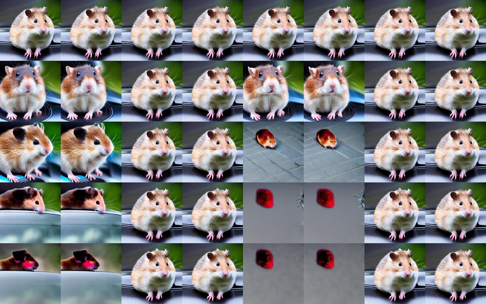

# attention map hand inject

- [toc]

### 前言

根据我们在“Prompt-to-Prompt Image Editing with Cross Attention Control”这篇文章复现过程中的探索, 我们尝试了手动控制attention map的方式, 发现确实可以得到一定的效果, 这一部分的研究值得深入, 附在文章复现的章节显得略微散乱, 所以再开一个新的章节来记录实验结果。


可以研究和验证的方向:

- [ ] 验证value在过程中是否不变
- [x] 尝试不同的inject方法
- [x] inject 更多大小的map
- [ ] 尝试self attention
- [ ] 尝试从init image中获取attention map
- [ ] 尝试从不同的seed中获取attention map
- [ ] 尝试某种形式的guidance


# 前期实验

在初步验证手动inject有效果后, 我们初步尝试了不同inject方式以及其他参数的影响, 获得基本的参数影响认知。


## function scale

本实验尝试了不同的inject function的影响, 每一列为一个function, 分别为

```python
def inject1(attention_scores, inject_map_dicts, inject_scale=3):
    """
    absolute adding on softmaxed map, only on 64*64 maps
    """
    attn_slice = attention_scores.softmax(dim=-1)
    if attention_scores.shape[1] == 64*64:
        for dic in inject_map_dicts:
            word_index = dic["word_index"]
            inject_map = dic["inject_map"]
            attn_slice[:,:,word_index] += inject_map * inject_scale
    return attn_slice

def inject2(attention_scores, inject_map_dicts, inject_scale=3):
    """
    absolute replace on softmaxed map, only on 64*64 maps
    """
    attn_slice = attention_scores.softmax(dim=-1)
    if attention_scores.shape[1] == 64*64:
        for dic in inject_map_dicts:
            word_index = dic["word_index"]
            inject_map = dic["inject_map"]
            attn_slice[:,:,word_index] = inject_map * inject_scale
    return attn_slice

def inject3(attention_scores, inject_map_dicts, inject_scale=30):
    """
    absolute adding on attention scores, only on 64*64 maps
    """
    if attention_scores.shape[1] == 64*64:
        for dic in inject_map_dicts:
            word_index = dic["word_index"]
            inject_map = dic["inject_map"]
            attention_scores[:,:,word_index] += inject_map * inject_scale
    
    attn_slice = attention_scores.softmax(dim=-1)
    return attn_slice

def inject4(attention_scores, inject_map_dicts, inject_scale=30):
    """
    absolute replacing on attention scores, only on 64*64 maps
    """
    if attention_scores.shape[1] == 64*64:
        for dic in inject_map_dicts:
            word_index = dic["word_index"]
            inject_map = dic["inject_map"]
            attention_scores[:,:,word_index] = inject_map * inject_scale
    attn_slice = attention_scores.softmax(dim=-1)
    return attn_slice


def inject5(attention_scores, inject_map_dicts, inject_scale=3):
    """
    absolute adding on softmaxed map, on both 32*32 and 64*64 maps
    """
    attn_slice = attention_scores.softmax(dim=-1)
    if attention_scores.shape[1] == 64*64:
        for dic in inject_map_dicts:
            word_index = dic["word_index"]
            inject_map = dic["inject_map"]
            attn_slice[:,:,word_index] += inject_map * inject_scale
    elif attention_scores.shape[1] == 32*32:
        for dic in inject_map_dicts:
            word_index = dic["word_index"]
            inject_map = dic["inject_map_32"]
            attn_slice[:,:,word_index] += inject_map * inject_scale
    return attn_slice

def inject6(attention_scores, inject_map_dicts, inject_scale=3):
    """
    absolute replace on softmaxed map, on both 32*32 and 64*64 maps
    """
    attn_slice = attention_scores.softmax(dim=-1)
    if attention_scores.shape[1] == 64*64:
        for dic in inject_map_dicts:
            word_index = dic["word_index"]
            inject_map = dic["inject_map"]
            attn_slice[:,:,word_index] = inject_map * inject_scale
    elif attention_scores.shape[1] == 32*32:
        for dic in inject_map_dicts:
            word_index = dic["word_index"]
            inject_map = dic["inject_map_32"]
            attn_slice[:,:,word_index] = inject_map * inject_scale
    return attn_slice

def inject7(attention_scores, inject_map_dicts, inject_scale=30):
    """
    absolute adding on attention scores, on both 32*32 and 64*64 maps
    """
    if attention_scores.shape[1] == 64*64:
        for dic in inject_map_dicts:
            word_index = dic["word_index"]
            inject_map = dic["inject_map"]
            attention_scores[:,:,word_index] += inject_map * inject_scale
    elif attention_scores.shape[1] == 32*32:
        for dic in inject_map_dicts:
            word_index = dic["word_index"]
            inject_map = dic["inject_map_32"]
            attention_scores[:,:,word_index] += inject_map * inject_scale
    
    attn_slice = attention_scores.softmax(dim=-1)
    return attn_slice

def inject8(attention_scores, inject_map_dicts, inject_scale=30):
    """
    absolute replacing on attention scores, on both 32*32 and 64*64 maps
    """
    if attention_scores.shape[1] == 64*64:
        for dic in inject_map_dicts:
            word_index = dic["word_index"]
            inject_map = dic["inject_map"]
            attention_scores[:,:,word_index] = inject_map * inject_scale
    elif attention_scores.shape[1] == 32*32:
        for dic in inject_map_dicts:
            word_index = dic["word_index"]
            inject_map = dic["inject_map_32"]
            attention_scores[:,:,word_index] = inject_map * inject_scale
    attn_slice = attention_scores.softmax(dim=-1)
    return attn_slice


inject_functions = [inject1, inject2, inject3, inject4, inject5, inject6, inject7, inject8]
```

prompt_edit_tokens_start=0.8

scale in [0, 1, 2, 3, 4], 依次递增




#### 结论是, inject更多的map更有效, 绝对值加在归一化之后会更有效, 但会变得不稳定。


## map-scale

横向scale [1., 1.5,2., 2.3, 2.7, 3., 3.2, 3.5]

function = inject5, 第一行为同时控制car和animal的map, 第二行只控制animal, 第三行只控制car


可以做到分别控制, 但是控制依然不稳定。


## scale-cs

for scale in [1., 1.5,2., 2.3, 2.7, 3., 3.2, 3.5]:
    for cs in [0.95, 0.9, 0.85, 0.8, 0.75, 0.6, 0.3]:

横向, cs 从0.3到0.95

纵向, scale 从1. 到3.5


作用力度过强, 作用时间过长, 都容易生成糟糕的图像。


## number

之前有注意到, diffusion model对于数量的控制不是很理想, 再联想到在之前的attention map inject过程中, 老虎因为身体过长而导致分裂, 出现两个虎头, 这可能说明attention区域的数量以及分离程度很可能影响图片中物体的数量。


# 寻找稳定方式

我们注意到, 不同阶段, 同一个词对应的attention map的均值或者说绝对值大小是不一样的, 原因是在获得attention score后, 是在最后一个维度, 也就是单词的维度进行softmax。也就是说, 在同一次迭代中,  不同词对应的attention map的权重可能是不一样的, 可能在某一步, 模型注重生成第二个词相关的内容, 而下一步模型又注重第四个词的生成了。

具体而言, 我们打印了64x64的attention map的均值和norm:

```python
    attn_slice = attention_scores.softmax(dim=-1)
    for dic in inject_map_dicts:
        word_index = dic["word_index"]
        if attention_scores.shape[1] == 64*64:
            print(attn_slice[:,:,word_index].mean())
            #print(torch.norm(attn_slice[:,:,word_index]))
```


```
#均值
tensor(0.0080, device='cuda:2')
tensor(0.0080, device='cuda:2')
tensor(0.0051, device='cuda:2')
tensor(0.0148, device='cuda:2')
tensor(0.0274, device='cuda:2')
tensor(0.0076, device='cuda:2')
tensor(0.0078, device='cuda:2')
tensor(0.0049, device='cuda:2')
tensor(0.0146, device='cuda:2')
tensor(0.0282, device='cuda:2')
tensor(0.0072, device='cuda:2')
#nrom
tensor(1.1415, device='cuda:2')
tensor(5.9604, device='cuda:2')
tensor(3.5211, device='cuda:2')
tensor(0.9643, device='cuda:2')
tensor(1.2418, device='cuda:2')
tensor(1.1404, device='cuda:2')
tensor(5.9061, device='cuda:2')
tensor(3.6695, device='cuda:2')
```

所以我们决定依据norm来确定我们inject的scale, 这样就不会因为绝对值上的inject而导致很难调节或者不稳定的情况, 实验还在做。

我们尝试了许多的和norm相关的设置inject scale的方法,  但是依然不work, 稳定的控制效果不好, 控制效果好的不稳定。

和学长交流后, 我们可以尝试某些guidance的方式, 或者用别的方式得到文理比较合理的attention map。

同时我们需要检查self attention如何改变, 同时, 我们需要验证value是否一直都不变化。