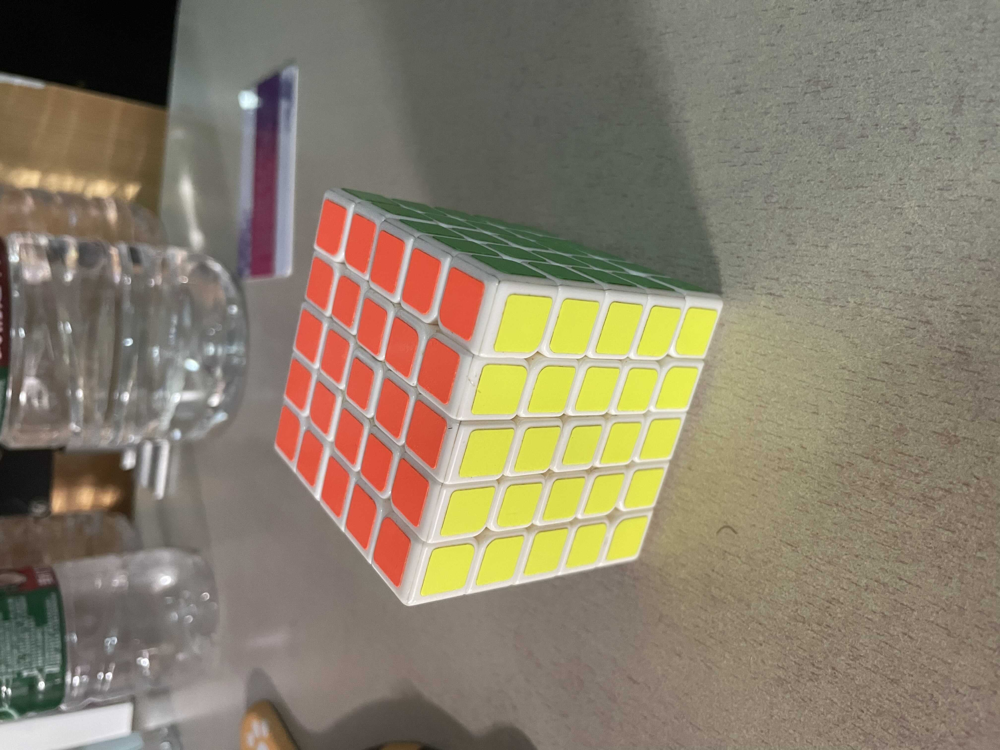

# Textual inversion

- [toc]

## 前言

这一部分主要聚焦如何控制一个固定物体在生成过程中出现, 但是却不改变模型的参数, 这里的复现工作主要基于“An Image is Worth One Word: Personalizing Text-to-Image Generation using Textual Inversion”, 代码则基于https://github.com/rinongal/textual_inversion, 使用的模型是ldm, 不是stable-diffusion。

我们在这里期望做到以下几点:

1. 复现代码, 看看效果
2. 尝试理解原理
3. 总结优点和缺点

因为文章思路很简单, 感觉没有十分值得讨论的地方, 我们只需要看以下效果。

### cat

|  |  |  |  |
| --------------------------------------- | --------------------------------------- | --------------------------------------- | --------------------------------------- |
|  |  |  |                                         |
|                                         |                                         |                                         |                                         |

#### a cake in style of cat

### airpods

|  |  |  |  |
| ---------------------------------------------------- | ---------------------------------------------------- | ---------------------------------------------------- | ---------------------------------------------------- |
|  |  |  |                                                      |

#### a red airpods

#### a picture of airpods

### magic cube

|  |  |  |
| ---------------------------------------------------- | ---------------------------------------------------- | ---------------------------------------------------- |
|  |  |  |

#### photo of maigc cube

#### red magic cube

#### magic cube by origin

### elephant

|          |  |  |
| ---------------------------------------------- | -------------------------------------- | -------------------------------------- |
|  |  |                                        |

#### elephant drinking water

#### elephant running

## 结论

1. 不变参数, flexible
2. 有一定效果
3. 训练1-2小时
4. 有不理想的地方