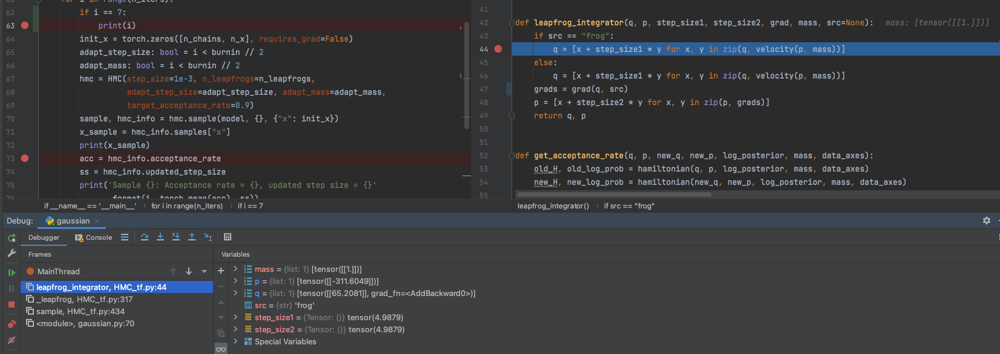

# 工作日志

珠算的工作过程主要是开发过程, 在开发中不断熟悉代码的框架, 对于工作日志而言, 主要就是记录以下遇到的问题, 但是如果不清楚问题的前提提要, 预计是看不懂问题在说什么, 所以这部分主要是笔者自己看, 他人随意就好。

## 安装pytorch珠算环境

#### pytorch 珠算

安装scipy

```shell
pip3 install cython pybind11
pip3 install --no-binary :all: --no-use-pep517 numpy
pip3 install pythran
brew install openblas gfortran
export OPENBLAS=/opt/homebrew/opt/openblas/lib/
pip3 install --no-binary :all: --no-use-pep517 scipy
pip install torch
pip install matplotlib
```

或者直接选择

```
conda install scipy
```

至此, 可以跑通`python -m unittest discover -v`。

`coverage report --include="zhusuan/*"`报告`No data to report.` 暂时先不管。

### TensorFlow 珠算

直接clone，`pip install .`


# HMC 问题

主要的表现问题为, test_mcmc中测试HMC中有较大的估计误差,  其次还没能跑出toy example中断gaussian.py,

接下来主要从几个方面来讨论和分析我们目前遇到问题的可能的原因:


## torch版本和tf版本实现的区别

### while 循环的是否允许梯度

```python
        _, q, p = tf.while_loop(loop_cond,
                                loop_body,
                                [i, q, p],
                                back_prop=False,
                                parallel_iterations=1)
```

### 但是在torch版本中, 如果禁用梯度, 是程序是无法运行的

```

```


## log_joint 和 梯度的问题

### log_joint 每次都需要单独的sn?

以下代码不能运行

```python
class Gaussian(BayesianNet):
    def __init__(self, n_x, std, n_particles):
        super(Gaussian, self).__init__()
        self._n_x = n_x
        self._std = std
        self._n_particles = n_particles
        dist = Normal(torch.zeros([n_x], dtype=torch.float32), std=self._std)
        self.sn(dist, "x", n_samples=self._n_particles)

    def forward(self, observed):
        self.observe(observed)
        return self

```

以下代码可以运行:

```python
class Gaussian(BayesianNet):
    def __init__(self, n_x, std, n_particles):
        super(Gaussian, self).__init__()
        self._n_x = n_x
        self._std = std
        self._n_particles = n_particles

    def forward(self, observed):
        self.observe(observed)
        dist = Normal(torch.zeros([n_x], dtype=torch.float32), std=self._std)
        self.sn(dist, "x", n_samples=self._n_particles)
        return self
```


### 梯度问题

```python
self.q = [v.clone().requires_grad_() for v in latent_v]
#如果不clone并且开启梯度, gaussian 也会报错

```


## gaussian 问题

1. 为什么方差会和n_chain 有关, n_chains 越大, 方差越大
2. 

在i=7时看梯度, 发现出现了超大的梯度




## 深度de HMC的bug

我们预计是求导的函数计算倒数错误导致了采样的错误, 正确的计算路径应该是根据当前给的varlist, 根据密度函数计算梯度, 但是目前看起来计算的是相加的梯度。


## 细查文档

1. 是否要添加conda 安装的命令
2. 
